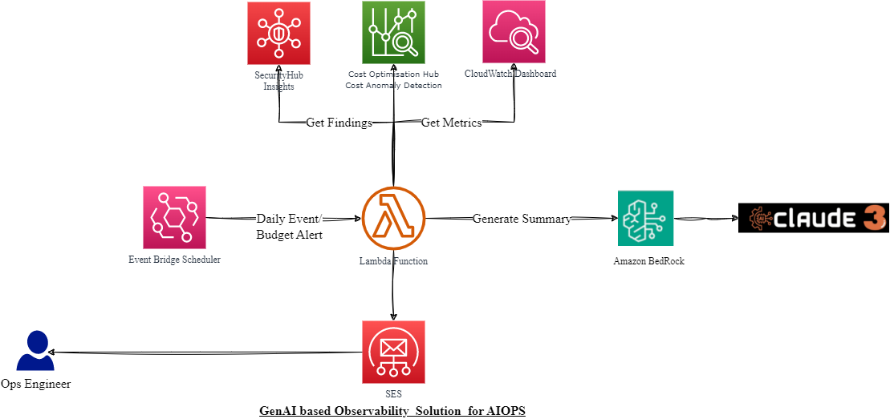
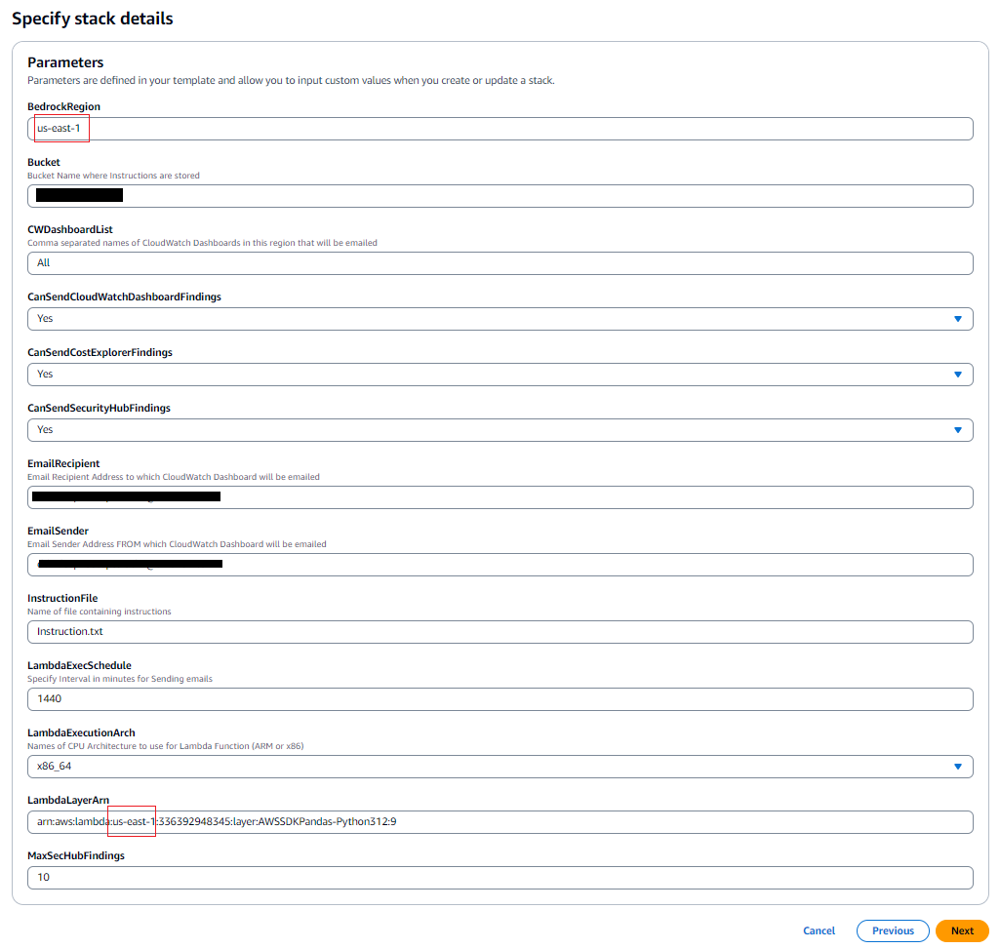
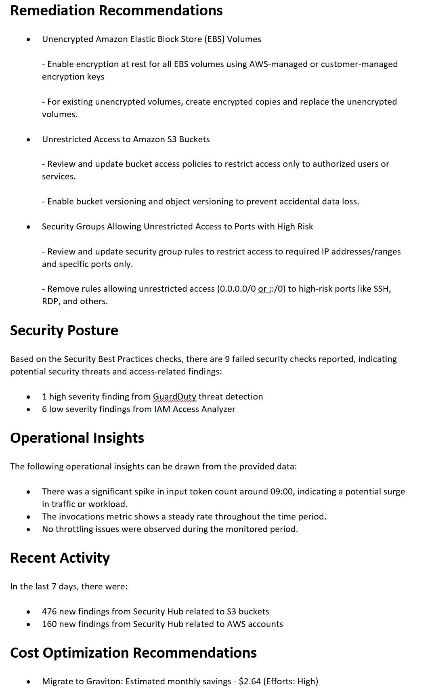
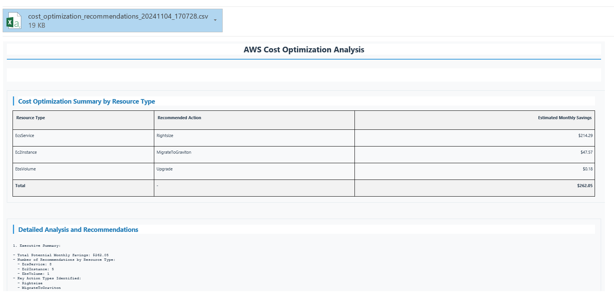
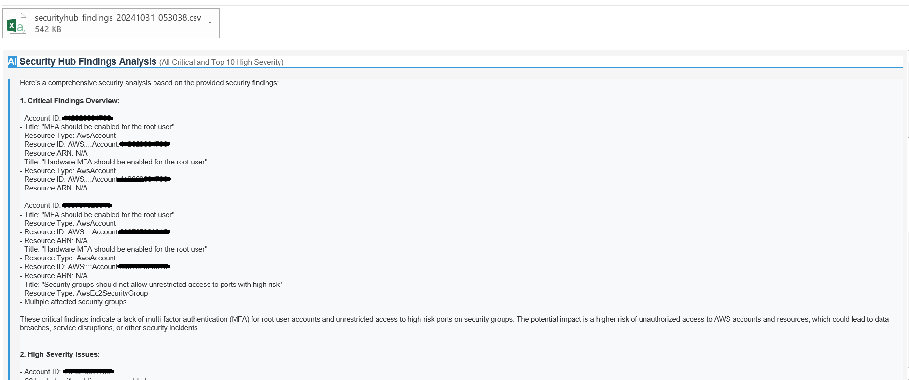

# GenAI-powered SecOps Intelligence and Reporting

## Overview
This repository contains a AWS CloudFormation template that deploys a comprehensive solution for SecOps Observability powered by Generative AI (GenAI). The solution leverages various AWS services, including Amazon Bedrock, to monitor IT systems, analyze logs and metrics, and provide intelligent insights.

## Challenge
Managing and monitoring the security posture of cloud environments can be a complex and time-consuming task. Security teams often struggle to keep up with the ever-increasing volume of security findings, metrics, and operational data. Manually analyzing and correlating this data to identify potential threats and vulnerabilities becomes increasingly challenging, leading to missed insights and delayed response times.

## Solution
The GenAI-powered SecOps Intelligence and Reporting Solution addresses these challenges by leveraging the power of Generative AI to automate the analysis and correlation of security findings, metrics, and operational data. The solution combines various AWS services, including Amazon Bedrock, to provide a comprehensive and intelligent monitoring solution for SecOps teams.

## Architecture


The solution consists of the following components:

1. AWS Security Hub Insights: Generates custom insights from AWS Security Hub findings.
2. Amazon CloudWatch Dashboard: Retrieves metrics and widget images from CloudWatch dashboards.
3. Amazon Event Bridge Scheduler: Triggers the solution daily for regular monitoring.
4. AWS Lambda Function: Orchestrates data collection and invokes Amazon Bedrock.
5. Amazon Bedrock: Leverages Anthropic Claude3 Sonnet model for data analysis and insight generation.
6. Amazon SES: Sends the GenAI-generated summary as an email report.

## Workflow
1. The Amazon Event Bridge Scheduler triggers the AWS Lambda function daily.
2. The AWS Lambda function collects data from AWS Security Hub and Amazon CloudWatch dashboards.
3. The collected data is passed to the Amazon Bedrock service for analysis by the GenAI model.
4. The GenAI model generates a comprehensive summary and recommendations based on the analyzed data.
5. The summary and recommendations are sent as an email report using Amazon SES.

## Prerequisites

Before deploying the GenAI-powered SecOps Intelligence and Reporting Solution, ensure that the following prerequisites are met:

1. Amazon CloudWatch Dashboards
   - Create one or more CloudWatch dashboards with relevant widgets to monitor your AWS resources and applications.
   - The dashboards should include widgets that display metrics, logs, and other operational data that you want to include in the analysis.

2. AWS Security Hub
   - Enable AWS Security Hub in your AWS account.
   - Configure Security Hub to receive findings from various AWS services and third-party security providers.

3. AWS Cost Optimization Hub
   - Enable AWS Cost Optimization Hub for all member accounts in your AWS Organization.
   - Create a Cost Anomaly Detection monitor to detect unexpected changes in your AWS cost and usage.

4. Anthropic Claude3 Sonnet Model
   - Obtain access to the Anthropic Claude3 Sonnet model through Amazon Bedrock.
   - Configure the necessary permissions and settings to allow your AWS account to use the Anthropic Claude3 Sonnet model.

5. AWS Services
   - Ensure that your AWS account has the necessary permissions and access to the following services:
     - Amazon CloudWatch
     - AWS Security Hub
     - AWS Cost Optimization Hub
     - Amazon S3
     - Amazon SES
     - AWS Lambda
     - Amazon EventBridge
     - Amazon Bedrock

6. Email Addresses
   - Prepare the email addresses to be used as the sender and recipient for the email reports.
   - Ensure that the email addresses are valid and verified.

Once you have fulfilled all the prerequisites, you can proceed with the deployment of the GenAI-powered SecOps Intelligence and Reporting Solution using the provided CloudFormation template.

## Deployment
Here are the steps to deploy the GenAI-powered SecOps Intelligence and Reporting Solution using the provided CloudFormation template (template.yml), along with a description of each parameter:

1. Clone the repository
   Clone this repository to your local machine using the following command:
   `git clone https://github.com/aws-samples/genai-powered-secops-intelligence-and-reporting-solution.git`

2. Navigate to the repository directory
   `cd genai-powered-secops-intelligence-and-reporting-solution`

3. Create an AWS CloudFormation stack
   Open the AWS CloudFormation console and click on "Create stack" -> "With new resources (standard)"..

4. Upload the CloudFormation template
   In the "Specify template" section, choose "Upload a template file" and select the `template.yml` file from your local repository.

5. Configure the parameters

   In the "Specify stack details" section, provide the following parameters:

   

   - BedrockRegion: The AWS region where Amazon Bedrock is deployed (e.g., us-east-1).

   - Bucket: The name of the S3 bucket where the instruction file will be stored.

   - CWDashboardList: A comma-separated list of CloudWatch dashboard names in the region that will be analyzed (e.g., "All" to include all dashboards).

   - CanSendCloudWatchDashboardFindings: Set to "Yes" to include findings from CloudWatch dashboards in the analysis.

   - CanSendCostExplorerFindings: Set to "Yes" to include findings from AWS Cost Explorer in the analysis.

   - CanSendSecurityHubFindings: Set to "Yes" to include findings from AWS Security Hub in the analysis.

   - EmailRecipient: The email address to which CloudWatch Dashboard findings and the GenAI-generated summary will be emailed.

   - EmailSender: The email address from which CloudWatch Dashboard findings and the GenAI-generated summary will be emailed.

   - InstructionFile: The name of the file containing instructions for the GenAI model (e.g., "Instruction.txt").

   - LambdaExecSchedule: The interval (in minutes) for sending email reports (e.g., 1440 for daily reports).

   - LambdaExecutionArch: The CPU architecture to use for the Lambda function (ARM or x86).

   - LambdaLayerArn: The ARN of the AWS SDK Pandas Python Layer deployed in the specified region (e.g. Please change the region if you are deploying cloud formation stack in different region, "arn:aws:lambda:us-west-2:336392948334:layer:AWSSDKPandas-Python312:9").
   
   - MaxSecHubFindings: The maximum number of Security Hub findings to include in the analysis (e.g., 10).

6. Review and deploy
   Review the parameter values and click "Next" to review the stack details. Finally, check the "I acknowledge that AWS CloudFormation might create IAM resources" box and click "Create stack" to deploy the solution.

Please note that some parameters, such as the S3 bucket name, email addresses, and instruction file name, may need to be customized based on your specific requirements and configurations.

## Benefits
- Automated analysis of security findings, metrics, and operational data
- Intelligent insights and recommendations powered by GenAI
- Comprehensive email reports for easy monitoring and decision-making
- Improved security posture and faster response times
- Reduced manual effort and increased operational efficiency


### Customizing Instructions

You can customize the instructions provided to the Anthropic Claude3 Sonnet model by modifying the `Instruction.txt` file stored in the specified S3 bucket. This file contains the instructions that guide the model's analysis and report generation process.

By editing the `Instruction.txt` file, you can:

- Specify the focus areas or specific aspects of the security findings, metrics, and operational data that you want the model to prioritize.
- Provide additional context or domain-specific knowledge to help the model generate more relevant and accurate insights.
- Adjust the level of detail or verbosity required in the generated reports.
- Define specific formatting or structuring requirements for the reports.

Example instructions in the `Instruction.txt` file:

```
1. Analyze the provided security findings, metrics, and operational data.
2. Focus on identifying potential security vulnerabilities, compliance issues, and cost optimization opportunities.
3. Provide actionable recommendations to mitigate risks and improve the overall security posture.
Prioritize recommendations based on their impact and urgency.
```

`Instruction.txt` file includes a default HTML template for the email notifications sent by Amazon SES. You can customize this template to align with your organization and formatting preferences.

To customize the email notification template, navigate to the `<Response Examples>` section in `Instruction.txt` file


## Sample Email Notification



## Deploy Weekly Cost Optimization Recommendation only
Here are the steps to deploy the only Weekly Cost Optimization Recommendation and Reporting Solution using the provided CloudFormation template (cfn_cost_optimization_recommendation_template.yml)

1. Create an AWS CloudFormation stack
   Open the AWS CloudFormation console and click on "Create stack" -> "With new resources (standard)"..

2. Upload the CloudFormation template
   In the "Specify template" section, choose "Upload a template file" and select the `cfn_cost_optimization_recommendation_template.yml` file from your local repository.

3. Configure the parameters

## Sample Weekly Cost Optimization Recommendation Email Notification




## Deploy Daily Security Hub Findings and Recommendation only

Here are the steps to deploy the only Security Hub Findings and Recommendation Solution using the provided CloudFormation template (cfn_security_hub_recommendation_template.yml)

#### Step 1: Prepare Lambda Code

1. **Create a Zip File**:
   Navigate to the directory where your `index.py` file is located and create a zip file:
   ```bash
   zip lambda_function.zip index.py
   ```

#### Step 2: Upload Lambda Code to S3

1. Access the **AWS Management Console**.
2. Navigate to **S3**.
3. Create a new bucket (or use an existing one) where you will store the Lambda function code.
4. Upload the `lambda_function.zip` file to your S3 bucket.

#### Step 3: Prepare CloudFormation Template

1. Download the CloudFormation template file (`cfn_security_hub_recommendation_template.yml`) from [here](/cfn_security_hub_recommendation_template.yml).
2. Ensure that your template includes parameters for `LambdaCodeBucket` and `LambdaCodeKey`.

#### Step 4: Create CloudFormation Stack

1. Navigate back to **CloudFormation** in the AWS Management Console.
2. Click on **Create Stack** and choose **With new resources (standard)**.
3. Under **Specify template**, select **Upload a template file**.
4. Upload the modified `aws-securityhub-findings-analyzer.yml` file.

#### Step 5: Configure Stack Parameters

1. Enter a **Stack name** (e.g., `SecurityHubFindingsAnalyzer`).
2. Provide the necessary parameters:
   - **LambdaCodeBucket**: Your S3 bucket name where the zip file is stored.
   - **LambdaCodeKey**: The key (path) for your uploaded zip file (e.g., `lambda_function.zip`).
   - `SENDER_EMAIL`: Your sender email address for SES.
   - `RECIPIENT_EMAIL`: Your recipient email address for SES.
   - `BEDROCK_MODEL_ID`: The model ID for Amazon Bedrock.
   - `FINDINGS_HOURS`: Specify how many hours back to look for findings (e.g., `24`).

#### Step 6: Review and Create Stack

#### Step 7: Execute the Lambda Function

Once deployed, you can manually invoke the Lambda function or let EventBridge trigger it:

1. **Manually Run the Function**:
   Go to the AWS Lambda console, select your deployed function, and click on **Test** to execute it.

## Sample Daily Security Hub Recommendations Email Notification



## Disclaimer

Please note that the recommendations provided by this GenAI-powered SecOps Intelligence and Reporting Solution are generated on a best-effort basis by the AI model. While the solution aims to provide intelligent and accurate insights, it is crucial for the operations team to exercise caution and consult with subject matter experts or specialists before executing any recommendations or making critical decisions.

The AI model's outputs should be carefully reviewed and validated by experienced professionals to ensure their applicability and alignment with your organization's specific requirements, policies, and best practices. The recommendations should be treated as guidance and used in conjunction with human expertise and domain knowledge.

It is essential to understand that the AI model's recommendations may not always be perfect or account for all possible scenarios or edge cases. Therefore, it is strongly recommended to conduct thorough testing and validation before implementing any significant changes based on the AI-generated recommendations.

The maintainers of this solution and the AI model provider cannot be held responsible for any direct or indirect consequences resulting from the implementation of the recommendations without proper due diligence and expert validation.

## Future Enhancements
- Integration with additional monitoring and logging services
- Customizable reporting formats and delivery methods
- Advanced anomaly detection and threat intelligence capabilities
- Continuous learning and model improvements through feedback loops

## FAQ
1. What is Amazon Bedrock?

   Amazon Bedrock is a service that provides secure and private access to powerful AI models, including large language models and computer vision models.

2. Can the solution be customized?

   Yes, the solution can be customized to fit specific requirements. The AWS CloudFormation template parameters can be adjusted, and the Lambda function code can be modified as needed.

3. How often are the email reports sent?

   By default, the email reports are sent daily. However, the scheduling can be adjusted in the Amazon Event Bridge rule to suit specific monitoring needs.

4. What is the purpose of the AWS Security Hub Insights?

   The Security Hub Insights provide a summary of the AWS account's security posture, failed security checks, Amazon GuardDuty findings, AWS IAM Access Analyzer findings, unresolved findings, and recent activity.

5. Can the solution be integrated with other monitoring tools?

   Yes, the solution can be extended to integrate with other monitoring tools by modifying the Lambda function to collect data from additional sources and pass it to the GenAI model for analysis.
